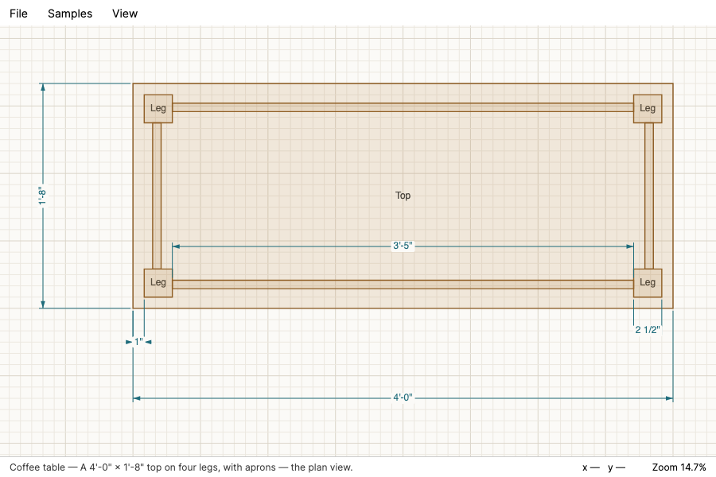
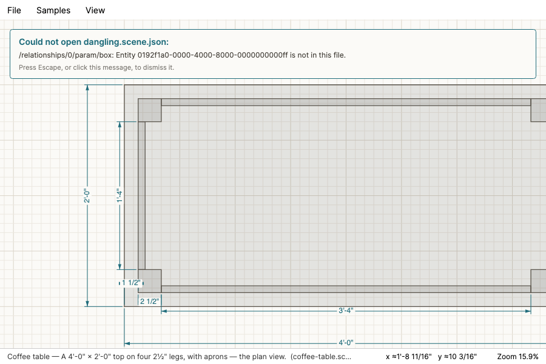
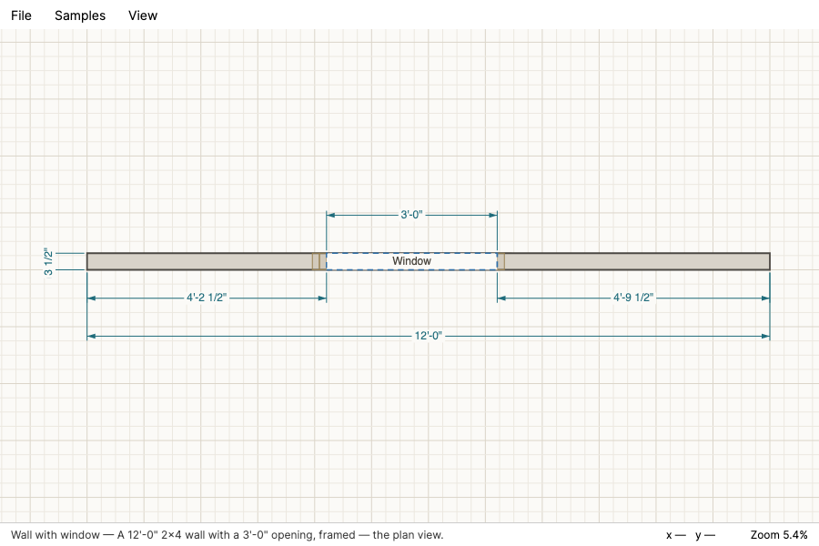

# The viewer

napkin's window (issue #36, milestone **M1 Look**): it opens a design file and draws it, and lets
you move around it. M1 was the whole of that on purpose — the drawing and the navigation had to
feel right before anything was allowed to change the model — and M2 added drawing and editing on
top of it without changing any of it. What follows is still M1's plan-view controls and hasn't been
rewritten for what M2-M5 added on top: editing and selection (M2), the 3D view alongside plan, a
wall tool, the code check and the bracing check (M4/M5), and the properties panel's wall and
opening fields. M3's cut list and properties panel are the sections below the controls; see
`docs/design/standard-views.md` for the views work this doc predates.



## Running it

```sh
dotnet run --project src/Napkin.App
```

It opens on the coffee-table sample, framed to fit. There is nothing to install and nothing to
configure; the sample files ship inside the build.

## What you are looking at

- **Parts** are drawn as outlined, lightly filled rectangles. How one is filled and outlined is
  chosen by the *name of the layer it is on* — a part on "Parts" gets the furniture look, "Wall"
  gets a thicker grey rectangle, "Opening" gets a dashed hole in the colour of the paper. Both
  sample files put everything on one layer called "Default", so everything in them draws in the
  neutral style; a file with those layer names in it gets those looks, and a file with layers
  napkin has never heard of still draws.
- **Names are drawn on parts that have one.** Scene format version 2 (#8) put a `name` on every
  entity, `FileDesignSource` reads them into `Design.Labels`, and the canvas draws them exactly as
  it always could — a leg from `coffee-table.scene.json` says "Leg, south-west". An entity whose
  name is the empty string has none and nothing is drawn for it; see
  [file-format.md](file-format.md).
- **Dimensions** are real dimension graphics — extension lines, a dimension line with arrowheads,
  and the value centred on it — not floating text. The value is computed from the geometry the
  dimension measures, every time it is drawn, and formatted as feet, inches and sixteenths by
  `Core.Geometry`'s `Format`. A value that cannot be shown exactly at that precision is marked with
  a leading `≈`, so a number on screen is never quietly rounded
  (`docs/design/geometry-model.md` §1.4).
- **Y is up**, as it is on a drawing and in DXF and PDF. The flip to the screen's downward Y lives
  in the view transform and nowhere else in the drawing code.
- **Line weights and text sizes are in pixels**, not inches, so the drawing reads the same zoomed
  out to the whole wall or in to a single joint.
- The **grid** steps through plain numbers — a quarter inch, an inch, three, six, a foot, two feet,
  and so on up — choosing the finest step that still leaves its lines far enough apart to see.

## Controls

| Gesture | What it does |
|---|---|
| **Ctrl/Cmd + O** | Open a scene file. |
| **Wheel** | Zoom about the pointer. The model point under the cursor stays under it. |
| **Shift + wheel** | Pan. A trackpad reports both axes, so it pans in both. |
| **Drag**, left or middle button | Pan. The drawing follows the hand. |
| **Arrow keys** | Pan by a tenth of the window; hold **Shift** for half. |
| **+** / **-** | Zoom in and out about the centre of the window. |
| **Ctrl/Cmd + 0** | Zoom to fit: frame everything, dimension lines included, with a margin. |
| **Ctrl/Cmd + 1**, **Ctrl/Cmd + 2** | Open the first or second sample. |
| **Ctrl/Cmd + L** | Open the cut list, or bring it forward. |
| **Escape** | Dismiss a refusal message. |

Left-drag pans in M1's read-only viewer, because there is nothing to select. Editing (M2, #10)
made the left button the selection gesture instead, with panning kept on the middle button and the
wheel; that table is this doc's M1 baseline, not what the shipped app's Select tool does today.

Zoom is limited at both ends — from an inch drawn at a fiftieth of a pixel, which fits a
1,500-foot site in a window, to an inch drawn across 2,400 pixels, which is finer than the
1/1024″ grid anything is stored on.

## The cut list, and what makes a box a part

**Ctrl/Cmd + L**, or *Lists → Cut list*, opens a window listing every piece the design says to cut:
the part's name, how many, its finished length, width and thickness, and what it is cut from. It is
not modal and it is not a snapshot — it follows the drawing, so an edit with the list open changes
the row. Every column sorts, and sorting reorders what is shown and changes no number. The header
line says what the list is: finished sizes with **joinery allowances included and saw kerf not**
(`docs/design/parts-and-cut-list.md` §1.3, `docs/design/joinery-and-fasteners.md` §6). Under a row
are its cut sentences and its joinery sentences, and "joint not satisfied" when a joint on it no
longer holds.

A box is not a piece to cut until somebody says so, because a plan view holds two of a part's three
dimensions and only the person drawing knows which two. Select a box and the **properties panel**
appears at the bottom right:

| Field | What it is |
|---|---|
| Name | What the part is called. Not an id, not unique — four legs may all be "Leg". |
| This is a piece to cut | Off for a wall or an opening, which stay off the cut list. |
| Across / Up | Which of *length*, *width* and *thickness* the box's own width and height are. |
| The third field | The one dimension the plan cannot hold. It is labelled with whichever name the two above did not claim. |
| Qty | How many identical copies this one box stands for — the four legs you draw once. |
| Stock | A nominal name, spelled however you like: "2x4", "2 x 4", "2×4" are one stock. |
| Species | Free text. This build never interprets it. |

The stock line under the field is the materials library's own: type `2 x 4` and it reads
`2x4 — actual 1 1/2" x 3 1/2", PS 20-25` before anything is applied. A name the library does not
carry is allowed and says so — the cut list reports it unresolved rather than guessing, so a
project drawn against a table a later build renames still opens and still lists.

The icon-per-category picker of issue #7's design — a floating toolbox, one icon per category, a
text list inside the chosen one — is not built yet; the typed field is what there is.

## The status line

Three things, left to right: which design is open, which file it came from, and what it is; where
the pointer is in the model as feet, inches and sixteenths; and the zoom as a percentage of life
size (100% is a model inch drawn at 96 pixels, Avalonia's device-independent inch). The pointer
readout is marked `≈` whenever the pixel it is over does not land exactly on a sixteenth — which is
most of the time, and is the point of the marker.

## Opening a file

**File → Open…**, or **Ctrl/Cmd + O**, opens the platform's file dialog filtered to `*.scene.json`
and `*.json`, and reads whatever is chosen with `Napkin.Core.Project`'s `SceneReader` — the same
reader, with the same strictness, that the samples go through. A file that opens is shown, framed
to fit, with its name in the window title and on the status line. Cancelling the dialog changes
nothing at all.

The dialog itself sits behind a one-method seam (`ISceneFilePicker`), because a native file dialog
is the one part of this path a headless test cannot drive; everything after it — the shortcut, the
command, the reader, the refusal, the canvas — is exercised for real by the GUI workflows.

### When a file is refused



The reader refuses rather than repairs (#6): a missing, empty or garbled file, a `formatVersion`
this build does not read, an unknown field, a decimal length, an id that names nothing, a
relationship kind this build's updater cannot hold. It reports **a list** of what was wrong, not
one line, and the viewer shows the whole list in a panel over the drawing. **Escape, or a click on
the message, dismisses it.**

Two promises are worth stating because they are what the panel is for:

- **Every problem is shown**, not the first. A file with four things wrong with it says four
  things. (The reader works in stages and stops after the first stage that found anything, so a
  file can still report fewer problems than it has faults — an unknown field is found before a
  dangling id is looked for. What it reports, the panel shows in full.)
- **The drawing you had is exactly as you left it**: the same sketch, the same view transform, the
  same title and the same status line. The design is loaded before anything on screen is touched,
  so there is no partly-opened state for a failure to leave behind, and the refusal panel floats
  over the canvas rather than docking beside it so that showing it cannot even change the viewport.

Nothing on this path throws: a reader that somehow threw, and a file dialog that failed, both end
up in the same panel rather than in a crash.

## The samples



Two drawings, in the **Samples** menu:

- **Coffee table** — a 4′-0″ × 2′-0″ top, four 2½″ legs inset 1½″ from the edges, and four ¾″
  aprons flush with the legs' outer faces.
- **Wall with window** — 12′-0″ of 5½″ wall with a 3′-0″ opening centred in it, 4′-6″ of wall
  either side.

**They are the files in [`samples/`](../samples/README.md)** — the same bytes
`tests/Napkin.Core.Project.Tests` checks the reader against, copied into the build output and into
a `dotnet publish` layout by a `Content` item in `src/Napkin.App/Napkin.App.csproj`. The Samples
menu opens them through `SceneReader` like any other file; there is no second, in-code copy of a
sample. There was until this change, because the viewer, the reader and the sample files were
written in parallel; two hand-computed copies of the same drawing is one more than can be kept
honest, and the copy that had no file behind it is the one that went.

Every number in them is a real shop or framing number, lands exactly on the 1/1024″ grid, and is
derived by hand in the fixture's `*.design.md` and `*.expected.json`. Nothing in either sample
rounds.

The only thing about a sample that is *not* in its file is the title and the one-line blurb the
menu and the status line show, and that is because the format stores no name for a drawing either.
Those live in `SampleFiles.Catalogue`. A scene file dropped into `samples/` that nobody catalogued
is still offered, under a title made from its file name.

## How it is tested

- The transform arithmetic — world/screen round trips, zoom about a cursor, fit-to-extents, the
  zoom limits — the dimension labels, and what `FileDesignSource` does with a missing, empty,
  garbled, wrong-version or dangling-reference file are unit tests in
  `tests/Napkin.App.GuiTests/Unit/`. The label expectations are read from each fixture's
  `samples/*.expected.json` rather than typed out, so the viewer and the reader are held to one set
  of hand-derived numbers.
- The gestures are GUI workflows in `tests/Napkin.App.GuiTests/Workflows/ViewerWorkflows.cs`,
  which drive the real window with simulated keyboard and mouse input on the headless platform —
  including `GUI-VIEW-05`, which opens two bad files through the real shortcut, dismisses each
  refusal (once with Escape, once with the mouse), checks that the drawing and the view never
  moved, and then opens a good one. See [gui-automation.md](testing/gui-automation.md).
- The screenshots on this page are frames those workflows rendered.
